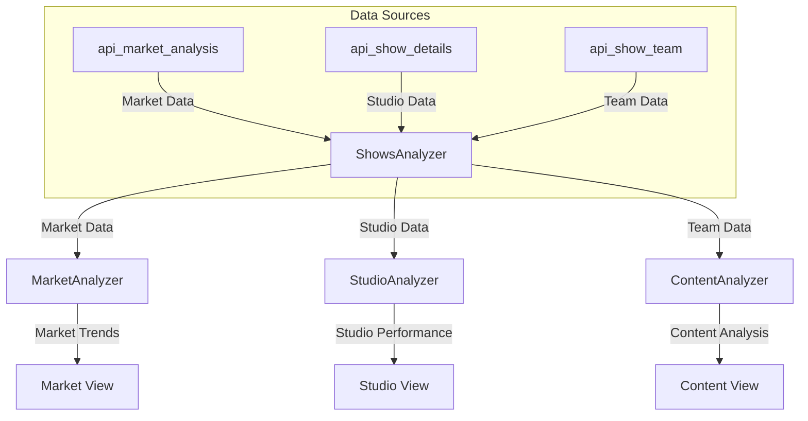

# Content Analysis Migration Audit

## Component Overview

### 1. Data Service Layer (`analyze_shows.py`)
- **Primary Class**: `ShowsAnalyzer`
- **Current Data Sources**:
  - Supabase Materialized Views:
    - `api_market_analysis` (titles view)
    - `api_network_stats` (networks view)
    - `api_show_team` (team data view)
- **Key Methods**:
  - `fetch_data()`: Retrieves data from all three views
  - Uses service key authentication for full access
  - Implements pagination for team data (1000 rows per page)

### 2. Analysis Layer (`unified_analyzer.py`)
- **Primary Class**: `UnifiedAnalyzer`
- **Dependencies**:
  - `shows_analyzer` (instance of ShowsAnalyzer)
  - `SuccessAnalyzer` (optional)
- **Data Flow**:
  1. Initializes by fetching data from `shows_analyzer`
  2. Processes three DataFrames:
     - `titles_df`
     - `team_df`
     - `network_df`
  3. Performs data transformations:
     - Converts episode_count to float
     - Validates required columns
- **Required Columns**:
  - source_type_name
  - genre_name
  - network_name
  - title
  - episode_count
  - order_type_name

### 3. View Layer (`unified_view.py`)
- **Components**:
  1. Acquisition View
     - Networks tab
     - Market Insights tab
  2. Packaging View
  3. Development View
- **Data Dependencies**:
  - Uses `UnifiedAnalyzer` for data processing
  - Optional `SuccessAnalyzer` integration

## Updated Data Flow

### Component-Specific Data Flows

1. **Market Analysis**
   - Uses `api_market_analysis` exclusively
   - No dependency on success metrics
   - Network distribution focus

2. **Studio Performance**
   - Uses `api_show_details` for core data
   - Separate indie and top studio pipelines
   - No success metrics in charts

3. **Content Analysis**
   - Uses both `api_show_details` and `api_show_team`
   - Team member analysis
   - Genre and format trends

## Migration Requirements

1. **Data Source Migration**
   - [x] Market Analysis View (already using Supabase)
   - [x] Network Stats View (already using Supabase)
   - [x] Show Team View (already using Supabase)

2. **Required Data Fields**
   - Base Tables:
     - tmdb_id (TMDB Show ID)
     - network_id (FK to network_list)
     - studios (Array of FKs to studio_list)
     - status_id (FK to status_types)
   - Views/APIs:
     - network_name
     - studio_names
     - status_name
     - title

3. **Column Standards**
   - All views must maintain consistent column naming
   - Critical columns must be present in materialized views

## Radio Button Views Data Requirements

### 1. Acquisition View
- **Networks Tab**
  - Required Fields:
    - title
    - network_name
    - success_score
    - title_count (per network)
  - Data Source: `api_market_analysis`, `api_network_stats`

- **Market Insights Tab**
  - Required Fields:
    - source_type_name
    - genre_name
    - network_name
    - success_score
    - title
  - Metrics Needed:
    - total_titles
    - avg_success
    - source_distribution
    - network_preferences
  - Data Source: `api_market_analysis`

### 2. Packaging View
- **Creators Tab**
  - Required Fields:
    - title
    - creator_names/team_members
    - network_name
    - success_score
    - total_titles (per creator)
  - Data Source: `api_market_analysis`, `api_show_team`

- **Package Suggestions Tab**
  - Required Fields:
    - creator_names
    - network_name
    - title
    - success_score
    - status_name
  - Special Values:
    - Development score (85.0)
    - Limited Run (0 points)
  - Data Source: `api_show_team`, `api_market_analysis`

### 3. Development View
- **Format Strategy**
  - Required Fields:
    - episode_count
    - title
    - source_type_name
    - genre_name
  - Metrics Needed:
    - most_common_format
    - avg_episodes
    - episode_distribution
  - Data Source: `api_market_analysis`

## Current Data Coverage in ShowsAnalyzer

### Available in Current Views
1. `api_market_analysis`:
   - title
   - network_name
   - source_type_name
   - genre_name
   - episode_count
   - success_score

2. `api_network_stats`:
   - network metrics
   - title counts
   - success scores

3. `api_show_team`:
   - team member data
   - creator associations

### Missing or Needs Verification
1. Creator/Team Data:
   - Verify if creator_names are properly normalized
   - Check team member role classifications
   - Validate creator-network relationships

2. Status Information:
   - Verify status_name field availability
   - Check development status indicators
   - Validate limited run identification

## Next Steps

1. **Data Validation**
   - Verify all required fields are present in Supabase views
   - Ensure data types match expectations (especially episode_count)
   - Validate foreign key relationships

2. **Active Filter Implementation**
   - Add active filter to relevant Supabase views
   - Update ShowsAnalyzer to handle active status

3. **Performance Optimization**
   - Review pagination implementation
   - Consider caching strategies
   - Optimize view queries

4. **Testing Strategy**
   - Compare output with current implementation
   - Validate data consistency
   - Test all view components with filtered data
