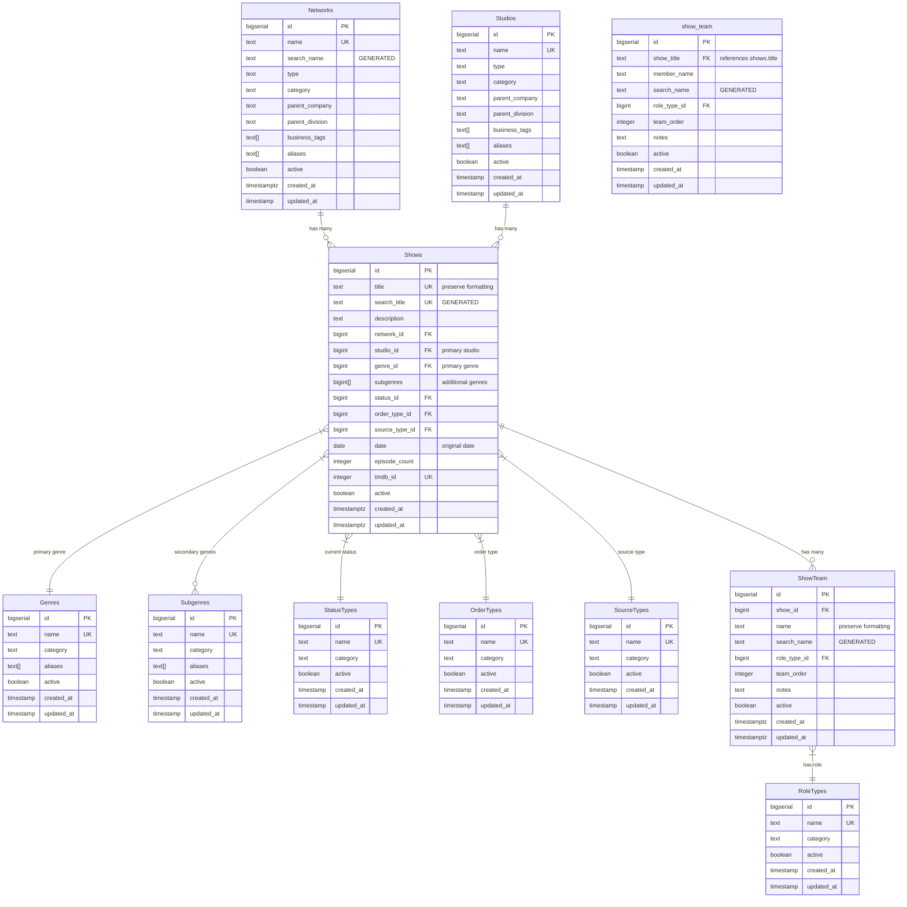

# Database Relationships

## Entity Relationship Diagram

## Key Relationships

### shows table
- Central entity
- Has many team members (through ShowTeam)
- Belongs to one Network
- Belongs to one Studio
- Has one primary Genre
- Has many secondary Genres (through subgenre_ids array)
- Has one StatusType
- Has one OrderType
- Has one SourceType

### show_team table
Matches current implementation:
- One row per creative per show
- Links to show via show_title field
- Captures:
  - Team member's name
  - Their role on the show
  - Team order (for display priority)
  - Additional notes
- Through name matching across shows, we can find:
  - All shows a person worked on
  - Their role history
  - Network/studio connections

### support tables
All support tables (Networks, Studios, Genres, etc.) follow similar patterns:
- Have unique names
- Include category and type fields where relevant
- Support aliases where needed
- Include active flag for soft deletes
- Track creation and update timestamps
